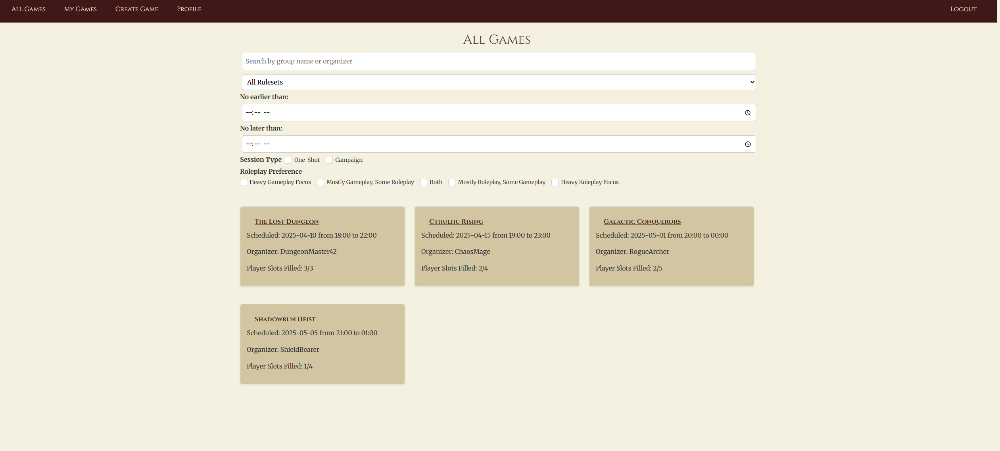
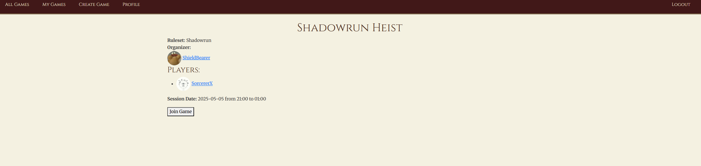
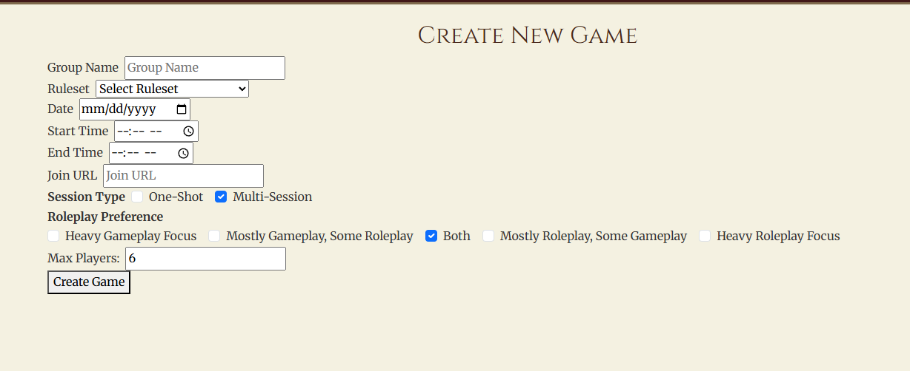

# 🧙‍♂️ TTRPG Scheduler

**TTRPG Scheduler** is a full-stack web app built with React and a JSON server backend that makes organizing and joining tabletop role-playing games (like *Dungeons & Dragons*, *Call of Cthulhu*, etc.) fast, social, and simple.

Players can browse active games, join open ones, or create their own with customizable details like ruleset, group size, play style, and more.

---

## ✨ Features

- 🔐 User authentication (login & register)
- 🎲 Browse all available TTRPG sessions
- 🧑‍🤝‍🧑 Join games with open slots or leave sessions
- 📝 Create, edit, or delete your own game listings
- 🧙 View player profiles and games they’re in
- 👤 Edit your own profile (username, picture, etc.)
- 📆 Track "My Games" for quick session access

---

## 🚀 Getting Started

### 1. Clone this repo

```bash
git clone https://github.com/your-username/ttrpg-scheduler.git
cd ttrpg-scheduler
```

### 2. Start the JSON server (API)

```bash
cd ttrpg-api
json-server database.json -p 8088
```

Make sure port 8088 is available. This serves your backend data.

### 3. Start the React frontend

From the root project directory:

```bash
npm install
npm run dev
```

Visit [http://localhost:5173](http://localhost:5173) in your browser.

---

## 🖼 Screenshots

### 🏠 All Games View



### 🎲 Game Details



### ✍️ Create Game Form



---

## 🧩 Tech Stack

| Frontend     | Backend         | Styling         |
| ------------ | --------------- | --------------- |
| React (Vite) | JSON Server     | Bootstrap / CSS |
| React Router | REST API (JSON) | Custom Styling  |

---

## 🔐 User Flow

1. Register or login as a user.
2. Navigate via the navbar to:

   * **All Games**: browse open sessions
   * **Create Game**: host your own TTRPG
   * **My Games**: view/edit/delete games you're in
   * **Profile**: update your profile info
3. Use "Join Game" buttons to participate, or "Leave"/"Delete" for sessions you're in.

> Organizers can edit/delete games they host. Other users can leave games they joined.

---

## 📁 Project Structure Highlights

```
ttrpg-scheduler/
├── ttrpg-api/                # JSON server backend
│   └── database.json         # Game, user, ruleset data
├── src/
│   ├── components/           # React components
│   ├── services/             # API helpers
│   ├── App.jsx               # Main router
├── screenshots/              # UI screenshots
└── README.md
```

---

## 💡 Example Users

You can use the following test accounts from the included `database.json`:

| Username        | Email                                       | Password        |
| --------------- | ------------------------------------------- | --------------- |
| DungeonMaster42 | [dm42@example.com](mailto:dm42@example.com) | hashedpassword1 |
| ElfWarrior      | [elf@example.com](mailto:elf@example.com)   | hashedpassword2 |
| ChaosMage       | [mage@example.com](mailto:mage@example.com) | hashedpassword3 |

> Passwords are mocked/hardcoded in JSON for development only. Do **not** use in production.

---

## 🧪 Future Improvements

* Chat integration per game
* Calendar sync / reminder emails